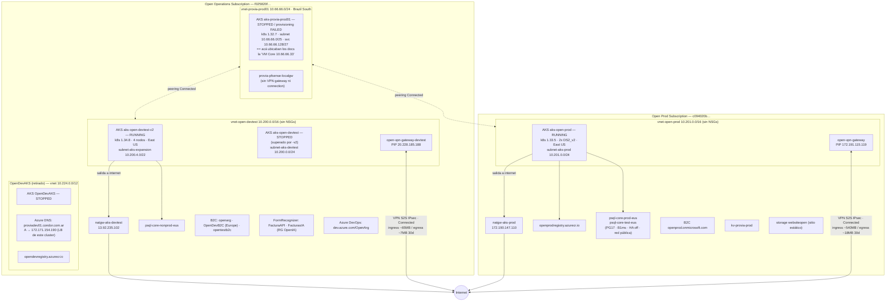
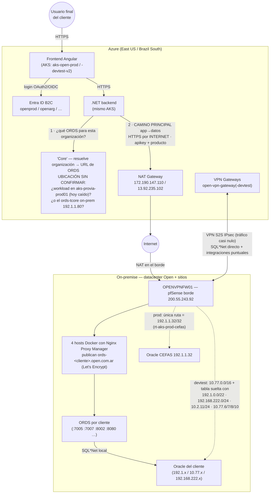

# Topología cloud (Azure) y su relación con on-premise

**Verificado contra el portal el 9 sep 2026** (identidad `gsalomone_ext@open.com.ar`, rol `Reader` en `Open Prod Subscription` y `Open Operations Subscription`). Reemplaza el diagrama anterior, que estaba armado solo desde `source/analisis_azure.txt`. Fuente de los datos: `inventory-cloud.json` (`verified_2026_09_09`) y `raw/`. Ver también `findings-cloud.md` §"Verificado contra el portal — 9 sep 2026".

Este es un plano de gestión distinto del de vSphere: se releva por el portal/CLI de Azure, no por TeamViewer/vCenter. Las capas de aplicación de Condor Work / Enterprise / ProvIA corren acá como contenedores en AKS, no como VMs.

---

## 1. Topología Azure — estado real

Notas:

- **Solo 2 de 5 clusters AKS corren**: `aks-open-prod` y `aks-open-devtest-v2`. `aks-open-devtest`, `OpenDevAKS` y `aks-provia-prod01` están detenidos (el de ProvIA además con aprovisionamiento fallido).
- `vnet-open-prod` y `vnet-open-devtest` **no** están peereadas entre sí; ambas peerean con `vnet-provia-prod01`.
- Falta ver adentro de los clusters (namespaces, imágenes, ingress) — `az aks get-credentials` da `AuthorizationFailed` con el `Reader` actual.

---

## 2. Cómo se conecta el plano cloud con el on-premise

Hay **dos caminos independientes** entre Azure y el datacenter on-premise, y llevan volúmenes de tráfico muy distintos:

### Camino 1 — ORDS sobre internet (el grueso del tráfico app → datos)

El backend .NET en AKS le pega a `https://ords-<cliente>.open.com.ar/.../ppcdr/` **por internet público**, no por la VPN. Sale por el NAT Gateway de Azure, entra por NAT en el pfSense de borde `OPENVPNFW01`, y el Nginx Proxy Manager on-premise lo enruta al ORDS interno del cliente (`192.1.2.54:7005`, `192.168.222.20:8080`, …), que a su vez habla SQL\*Net local con el Oracle. Autenticación: `apikey` + `producto` en el header, validados en la base del cliente (`condor.valida_servicios_ords`). Detalle y diagrama de secuencia en `relevamiento_azure.md` §"Bloque 8".

### Camino 2 — VPN S2S IPsec (bajo volumen, control / integraciones)

Dos túneles IPsec, ambos `Connected` el 9 sep 2026, terminan en el mismo pfSense de borde `OPENVPNFW01` (`200.55.243.92`):

| Túnel | Suscripción | Tráfico 30d | Qué on-prem alcanza (route tables) |
|---|---|---|---|
| `open-pfsense-connection` | Open Prod | in ~540 MB / out ~18 MB | **Solo `192.1.1.32/32`** = Oracle de CEFAS (`rt-aks-prod-cefas`, adosada a `subnet-aks-prod`) |
| `open-pfsense-connection-devtest` | Open Operations | in ~65 MB / out ~7 MB | `10.77.0.0/16` (`rt-aks-to-pfsense`, adosada). Tabla `rt-aks-to-pfsense-dev` (hoy sin adosar) lista además `10.2.11.0/24`, `10.77.6/7/8/10.0/24`, `192.1.0.0/22`, `192.168.100.0/24`, `192.168.222.0/24` |

`vnet-provia-prod01` tiene un `provia-pfsense-localgw` pero **ningún VPN gateway ni connection** — la VPN de ProvIA prod quedó a medio configurar, coherente con el cluster detenido.

### El punto que une los dos planos: el "Core"

El backend en AKS necesita, para cada organización, saber a qué `ords-<cliente>` pegarle. Esa resolución la hace el "Core". Los documentos del equipo saliente lo ubicaban en una VM de Azure en `10.66.66.33` — **pero esa IP es la VNet del cluster `aks-provia-prod01` (Brazil South), que está detenido, y no hay ninguna VM standalone**. Queda por confirmar si el Core corre (corría) como workload de Kubernetes ahí, o si siempre fue el `ords-tcore → 192.1.1.80` on-premise (mismo esquema de puertos 8090/8050/8040) mal rotulado. Es la pregunta #1 para la reunión con el equipo saliente.

---

## 3. Confirmado vs. inferido en estos diagramas

- **Confirmado (portal, 9 sep 2026):** todos los recursos, estados de encendido, VNets/subredes/peerings, estado `Connected` y volúmenes de los dos túneles VPN, las rutas de las route tables, los 4 tenants B2C, la org de DevOps, la única zona DNS en Azure, la ausencia de NSGs.
- **Confirmado antes (on-premise, `infra/findings.md`):** `OPENVPNFW01` como pfSense de borde y único punto de entrada desde internet; los 4 NPM que publican los `ords-<cliente>`; el circuito NPM → ORDS → Oracle.
- **Inferido / documental, sin verificar en vivo:** el flujo interno navegador → Angular → .NET → Core → ORDS (sale de `source/arquitectura_configuraciones_instalacion.txt`); que el grueso del tráfico app→datos va por internet y no por la VPN (consistente con los volúmenes bajos de los túneles, pero no medido del lado app).
- **Abierto:** ubicación real del "Core"; si `aks-provia-prod01` se detuvo a propósito o se cayó; qué esquemas viven en `psql-core-*` (Oracle vs PostgreSQL); a qué sitio físico corresponde `192.168.222.0/24`.

---

## Cómo regenerar esto

No es generado desde el JSON — se dibuja a mano leyendo `inventory-cloud.json` (`azure.aks_clusters`, `azure.networking`) y `findings-cloud.md`. Al confirmar algo nuevo por el portal (o al conseguir acceso a los clusters / DevOps / B2C), actualizar el diagrama y la tabla §3, y anotar la fuente en el label del enlace, igual que en `infra/topology.md` §4.
