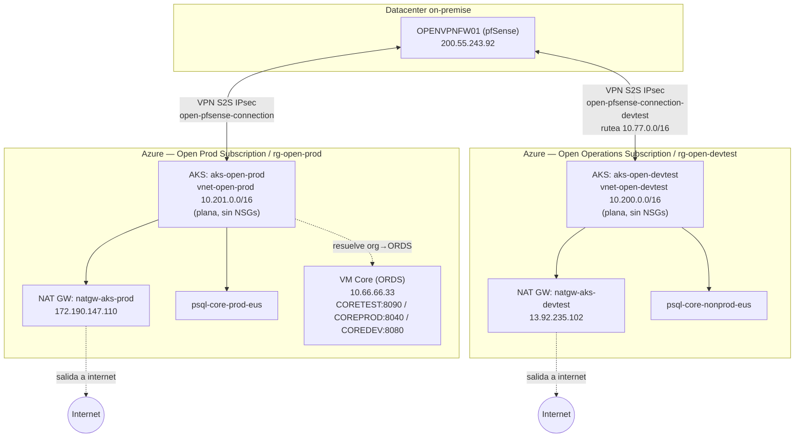

# Topología cloud (Azure/AKS) — estacionado

Sacado de `infra/topology.md` cuando se acotó el alcance del relevamiento actual a on-premise. Ver `cloud-infra/README.md`. Basado en `source/analisis_azure.txt`. No es parte del inventario de vSphere — es un plano de gestión completamente distinto (portal/CLI de Azure, no TeamViewer/vCenter). Las capas de aplicación de Condor Work, Enterprise, y ProvIA corren acá como contenedores, no como VMs de vSphere.

Los dos túneles VPN terminan en el mismo firewall pfSense, `OPENVPNFW01` — confirmado por coincidencia de IP (`200.55.243.92`), no solo una conjetura por el SO invitado FreeBSD. Ese hallazgo específico (identidad de `OPENVPNFW01`) sigue documentado en `infra/findings.md` porque es sobre una VM on-premise, aunque la evidencia haya salido de un documento de Azure.

El tráfico de la VPN en sí es bajo (mayormente acceso a Oracle DB e integraciones puntuales desde Azure hacia on-premise); la mayor parte de la salida de AKS va directo a internet vía NAT Gateway (llamadas a ORDS/APIs), no por el túnel. El detalle completo — suscripciones, resource groups, IPs públicas, volúmenes de tráfico, la VM Core — está en `inventory-cloud.json` y en `source/analisis_azure.txt`.
