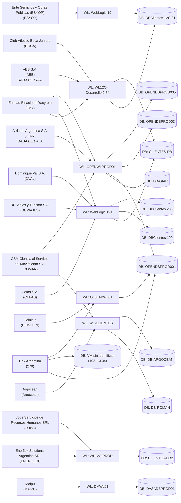

# Topología de infraestructura (vistas generadas)

Generado a partir de [`inventory.json`](inventory.json). No editar los diagramas de abajo a mano — regenerarlos desde el JSON (ver CLAUDE.md) cada vez que el JSON cambie, para que nunca queden desincronizados.

**Alcance: solo on-premise (vSphere).** La infraestructura en proveedores cloud (Azure/AWS) se estacionó fuera del alcance de este relevamiento — ver [../cloud-infra/README.md](../cloud-infra/README.md) para lo que ya se había encontrado ahí antes de acotar el foco.

## 1. Mapeo Cliente → WebLogic → Base de datos (vSphere on-premise)

Construido resolviendo los servidores WebLogic/DB declarados de cada cliente (del CSV de Relevamiento y, donde hay más detalle, de la matriz de clientes `Matriz_servicios_por_cliente_Hosting_V2.xlsx`) contra el inventario real de VMs en ExportList.csv — matcheado por nombre, y si el nombre no coincide, por IP (ver `resolved_by` en el JSON). 15 clientes en total: los 13 del CSV original de Relevamiento, más **Rex Argentina** y **Argocean**, ambos encontrados solo en la matriz más completa (ver findings.md). **ABB y Arris/GIAR están marcados en la matriz como ya dados de baja** — se mantienen en el diagrama porque sus VMs todavía existen y corren, pero no tratarlos como producción activa sin confirmar el estado actual. **ABB (6 sep 2026):** trazado en vivo — DB productiva confirmada `192.1.1.31` (`DBClientes-12C.31`, instancia `ABB`, schema `CONDOR`); `DBClientes.190` **descartada** como DB de ABB (solo tiene sub‑bases históricas apagadas). Además, ABB **sin una sola sesión ni DML desde el 1‑jul‑2026** — apagado de hecho, lo que respalda la marca de baja (ver `findings.md`).

Prestar atención a las instancias compartidas: varios clientes están en la *misma* VM de WebLogic y/o la misma VM de base de datos — es un dato de radio de impacto que conviene saber antes de tocar cualquiera de ellas.

**EBY (12 sep 2026):** DB cerrada a un solo nodo real, `OPENDBPROD005` — la candidata `Database .90` (detrás de la ruta paralela `yacyreta`/`WebLogic.191`) quedó descartada por `sqlplus` directo (esa DB es de `SIGO`, un tenant de `WebLogic.191` sin código de cliente asignado, fuera del alcance de este diagrama). EBY sigue con **dos** nodos WL en el diagrama (`WebLogic.191` y `OPENWLPROD01`) porque ambos corren tráfico Forms productivo real y concurrente — no es ambigüedad sin resolver, son dos stacks vivos a la vez.



**Leer este diagrama con cuidado — varios nodos son engañosos:**

- **`DBClientes-12C.31` la comparten ABB y ESYOP** (`WL12C-Desarrollo.2.54 → DBClientes-12C.31` y `WebLogic.19 → DBClientes-12C.31`): confirmado en vivo el 6 sep 2026 — instancias Oracle separadas (`ABB` y `esyop`) en el mismo box. `DBClientes.190` la usa **solo DCVIAJES** (vía `WebLogic.191`); la flecha ABB→`DBClientes.190` que había antes se quitó — ese box solo tiene sub‑bases históricas de ABB (`abbhist`/`abbtubio`, apagadas), no su DB productiva.
- **`EBY`, `ROMAN`, `GIAR` y `Rex Argentina` (`279`) tienen más de un nodo WL y/o DB** — a diferencia del resto, no es "un cliente, un servidor": son candidatos en paralelo (stack legado vs. nuevo, o candidatos sin confirmar todavía). El emparejamiento WL→DB que muestra el diagrama para estos cuatro está curado a mano con la evidencia real de cada trazado (`plan_relevamiento_alta_eby.md`, `infra/findings.md`), no generado mecánicamente — antes de tocar cualquiera de estos nodos, leer el detalle en `clients[].weblogic.resolved`/`.database.resolved` (campo `notes`), no asumir por la flecha. **Excepción: EBY ya no tiene ambigüedad de DB** (cerrado 12 sep 2026, un solo nodo `OPENDBPROD005`) — sus dos nodos WL siguen dobles porque ambos stacks están vivos en simultáneo, no porque falte resolver cuál es el real.
- **`OPENWLPROD01` y `OPENDBPROD001` son ahora los hosts más compartidos del segundo nivel** (después de `WebLogic.191`/8 clientes y `CLIENTES-DB`/3 instancias): `OPENWLPROD01` sirve a EBY, GIAR y ROMAN; `OPENDBPROD001` a Heinlein, CEFAS (destino), GIAR y Rex Argentina — ninguno de estos últimos tres verificado en vivo todavía, solo por `tnsnames.ora`/NPM.
- **Rex Argentina (`279`) tiene 2 candidatos de DB y 1 de WL, ninguno confirmado** — primera vez que aparece algo de infraestructura de Rex en este diagrama (antes no tenía ningún nodo resuelto).

> La topología Azure/AKS que estaba acá se movió a [`../cloud-infra/topology-cloud.md`](../cloud-infra/topology-cloud.md) — infraestructura cloud fuera de alcance por ahora, ver [`../cloud-infra/README.md`](../cloud-infra/README.md).

## 2. Inventario de VMs por categoría (las 129 VMs del sitio principal, de ExportList.csv)

Solo los totales — ver `inventory.json` → `vms[].category` para la lista de miembros de cada grupo. Las categorías se asignaron por coincidencia de nombre/SO salvo que se indique lo contrario por confirmación vía el material de los emails/RAR (ver findings.md para qué está confirmado y qué sigue siendo conjetura). Acotado al sitio principal — las 15 VMs del sitio Piedras (`vms[].site == "Piedras"`) tienen su propia tabla en la §3 de abajo, tanto por ser un cluster/host separado como por venir de un export distinto (`ExportList-Piedras-Full.csv`).

| Categoría | Cantidad | Confianza |
|---|---|---|
| database | 33 | Mixta — varias confirmadas vía el mapeo de clientes, el resto inferidas solo por nombre |
| workstation_or_jumphost | 20 | Inferida (SO invitado Windows 7/10 + nombre) |
| weblogic_app | 18 | Mixta — varias confirmadas vía el mapeo de clientes, el resto inferidas solo por nombre |
| unclear | 14 | Sin señal en el nombre, o una conjetura previa (candidato a nginx) que resultó incorrecta |
| infra_generic_unclear | 12 | Desconocida — el nombre genérico `OPENINFRxx` no dice nada sobre el rol |
| firewall_confirmed_pfsense | 7 (`OPENVPNFW01` por IP del peer VPN de Azure; `CliProFw01`, `DMFW01`, `FW`, `FWOPEN`, `OPENFWCLI001`, `OPENFWCLI10` por el relevamiento manual de pfSense) | **Confirmada** |
| docker_host_confirmed / docker_host_confirmed_nginx_proxy_manager | 9 (5 + 4) | **Confirmada** — detalle a nivel contenedor del relevamiento de Docker, incl. cuáles 4 corren Nginx Proxy Manager |
| bi_reporting | 4 | Inferida (Jasper/MicroStrategy en el nombre) |
| backup | 2 | Inferida (Veeam en el nombre) — incluye `VEEAM-PIEDRAS`, en el sitio principal pese al nombre, rol sin confirmar |
| firewall_candidate_pfsense | 2 (`OPENFWCLI02`, `VM_FW`) | Inferida (SO invitado FreeBSD + nombre con fw/vpn), todavía sin confirmar |
| source_repo | 2 | Inferida (SVN en el nombre) |
| domain_controller, file_server, monitoring, mail, storage_nas, virtualization_mgmt | 1 cada una | Inferida por nombre/SO |

## 3. Hosts / clusters ESXi

13 IPs de host ESXi en total, entre `ExportList.csv` (sitio principal) y `ExportList-Piedras-Full.csv` (sitio Piedras, confirmado el 18 ago 2026 — ver abajo):

- **192.1.1.214 – 192.1.1.224** (11 hosts) — cluster principal, aloja la mayoría de las VMs WL/DB de cara al cliente.
- **192.1.3.252** (1 host) — aloja un conjunto distinto de VMs en otros rangos de IP (`172.18.5.x`, `10.10.1.x`, `192.1.3.x`) incluyendo `WL-ROMAN`, `DB-ROMAN`, `DB-GIAR`, `WL-GIAR`, `FW`, `WL12-Clientes`. **Probablemente un sitio físico separado o una máquina standalone fuera del cluster principal** — todavía sin confirmar, no comparte el patrón de gestión 192.1.1.x de los demás.

### Capacidad por host — asignado vs. físico real (12 sep 2026, pedido de Alexis Lombardi) — sobreasignación confirmada con datos exactos

Todo del mismo snapshot — dos exports regenerados el 12 sep 2026 con formato completo: `ExportList20260912.csv` (host, RAM/vCPU asignada, estado, uso real por VM) y `ExportList-hosts_and_clusters20260912.csv` (`Memory Size (MB)` por host — RAM física real, exacta, ya no una inferencia por porcentaje). Piedras (`192.168.100.4`) se suma con `ExportListPiedras-host_and_clusters20260912.csv` (15 sep). Detalle del método y de la versión anterior (aproximada) en `infra/findings.md`.

| Host | VMs (total/ON) | vCPU asig. (total/ON) | RAM asignada GB (total/ON) | RAM real usada GB (ON) | RAM física exacta GB | Excedente/margen GB (%) | ¿Sobreasignado? |
|---|---|---|---|---|---|---|---|
| 192.1.1.214 | 5/4 | 30/22 | 86/62 | 49.7 | 120.0 | −58 (−48%) | no |
| 192.1.1.215 | 8/8 | 46/46 | 126/126 | 64.2 | 140.0 | −14 (−10%) | no |
| **192.1.1.216** | 11/10 | 33/29 | 129/105 | 51.5 | 63.9 | **+41 (+64%)** | **sí** |
| **192.1.1.217** | 7/7 | 56/56 | 110/110 | 71.3 | 95.9 | +14 (+15%) | **sí** |
| **192.1.1.218** | 7/5 | 36/30 | 100/66 | 51.6 | 64.0 | +2 (+3%) | **sí** |
| 192.1.1.219 | 7/6 | 32/24 | 58/52 | 45.9 | 72.0 | −20 (−28%) | no |
| 192.1.1.220 | 9/6 | 39/32 | 106/70 | 44.1 | 128.0 | −58 (−45%) | no |
| **192.1.1.221** | 22/5 | 60/20 | 128/46 | 32.7 | 40.0 | +6 (+15%) | **sí** |
| 192.1.1.222 | 5/3 | 23/13 | 92/36 | 23.4 | 128.0 | −92 (−72%) | no |
| **192.1.1.223** | 17/15 | 136/118 | **326/286** | **231.8** | 255.9 | +30 (+12%) | **sí** — único host con `Status: Warning` en vCenter |
| **192.1.1.224** | 16/14 | 115/107 | **324/292** | **238.1** | 255.9 | +36 (+14%) | **sí** |
| 192.1.3.252 | 18/11 | 108/60 | 186/110 | 105.7 | 127.3 | −17 (−14%) | no |
| 192.168.100.4 (Piedras) | 15/2 | 58/6 | 177/16 | 16.1 | 32.0 | −16 (−50%) | no — hoy |

**6 de 12 hosts sobreasignados con datos exactos: `.216`, `.217`, `.218`, `.221`, `.223`, `.224`.** `192.1.1.215` sale de la lista respecto al corte anterior (aproximado) — con RAM física exacta tiene 14 GB de margen, no estaba realmente al límite. En GB absolutos, `.223`/`.224` son los más críticos (+30/+36 GB); en términos relativos, **`.216` es el peor (+64%)** pese a ser un host más chico. CPU sigue sin poder confirmarse de la misma forma — ahora se conocen los sockets físicos por host, pero faltan cores/GHz; si hace falta el dato exacto, requiere TeamViewer. **Piedras no está sobreasignado hoy (solo 2/15 VMs encendidas), pero tiene sobreasignación latente severa**: sus 13 VMs apagadas suman 177 GB configurados contra apenas 32 GB físicos — no soportaría reactivarlas todas.

`.223`/`.224` son los candidatos más fuertes a sobreasignación de RAM: mayor RAM asignada del cluster y uso real ya al 76-82% de lo asignado. Sin la capacidad física del host, no se puede confirmar overcommit — solo apuntar dónde mirar primero.
- **192.168.100.4** (1 host) — **sitio "Piedras", confirmado.** Ver sección aparte abajo.

### Sitio "Piedras" — confirmado (18 ago 2026)

Lo que era una mención verbal sin más rastro que el nombre de una VM de backup (`VEEAM-PIEDRAS`, dentro del cluster principal — no coincide con esto) quedó confirmado por dos vías independientes el mismo día: una sesión de TeamViewer activa dentro de un host en `192.168.100.165/24` (mismo subnet que el dashboard pfSense "Open - Piedras" en `192.168.100.1` que no había respondido durante el relevamiento manual de firewalls), y un export de vCenter propio del sitio (`ExportList-Piedras-Full.csv`) que lista 15 VMs en un host ESXi separado, `192.168.100.4`.

Solo 2 de las 15 VMs están encendidas — el resto no reporta IP en el export (vCenter solo ve la IP de un invitado con VMware Tools corriendo, mismo patrón que `OPENDOCKER03` en el sitio principal):

| VM | Estado | Rol (inferido) |
|---|---|---|
| `Win10-Piedras` | Encendido, `192.168.100.165` | Estación desde la que se confirmó el sitio — sesión de TeamViewer activa |
| `DC2` | Encendido, `192.168.100.2` | Controlador de dominio (el sitio principal tiene `DC1`) — sugiere que Piedras es un sitio AD replicado, no aislado |
| `OpenPiedrasFw01` | Apagado | Candidato fuerte a pfSense (FreeBSD, 2 NICs, nombre) — probablemente el firewall detrás del dashboard `192.168.100.1` que "no responde"; estar apagada lo explicaría |
| `PiedrasDB01`, `PiedrasWL01` | Apagadas | DB/WL propios del sitio — `PiedrasWL01` tiene una nota explícita de que es un WebLogic de prueba/licencia, no producción |
| `weblogic14C01`, `OPENDB_31`, `OPENDBRMAN` | Apagadas | WebLogic/DB adicionales |
| `OPENSHARE`, `OPENAPPS`, `COBRA`, `CLIENTESRDP` | Apagadas | Almacenamiento compartido, apps, y una VM (`COBRA`) que no coincide con ningún cliente conocido — mismo patrón por el que se encontró Argocean, sin confirmar todavía |
| `OEM`, `OPENMONITOR10`, `OPEN_GRAFANA` | Apagadas | Monitoreo/administración del sitio |

**Conectividad de red hacia el cluster principal, confirmada en vivo (18 ago 2026).** Desde la sesión de TeamViewer en `Win10-Piedras` (`192.168.100.165`), `http://192.1.1.38:81/` — el panel de Nginx Proxy Manager de `VM-DOCKER-Clientes`, en el cluster principal — respondió directamente, sin salto intermedio. Piedras no es un sitio aislado de red: alcanza al menos el segmento `192.1.1.x`, además del `10.77.254.x` ya inferido por el backup de `OPENDB_31` hacia `OPENBK`. Esto habilita mapear el ítem 1 de Tier 1 (dominio → NPM → servidor, ver `../plan_relevamiento_alta_cefas.md`) directamente desde una sesión a Piedras, sin necesitar un salto a una VM del cluster principal primero.

Detalle completo, notas de cada VM y hallazgos derivados en `infra/inventory.json` → `meta.piedras_site` / `vms[].site == "Piedras"` y en `infra/findings.md`.

## 4. Diagrama de red de alto nivel (sitios, firewalls, conectividad)

A diferencia de §1–§3 (que agrupan VMs por cliente o por categoría), esta vista es a nivel de **red**: qué sitios existen, qué firewall hay en el borde de cada uno, y qué conectividad entre sitios está confirmada vs. inferida. Es la vista que responde "¿qué hay en el datacenter Open y qué hay en la oficina Piedras, a alto nivel?".

**A mano, no generado del JSON** — a diferencia de §1, esta vista no se recorre mecánicamente desde `clients[]`; se arma leyendo `vms[].category` (firewalls, docker hosts) y `meta`/`esxi_hosts`/`piedras_esxi_hosts`. Si cambia la topología de red (un firewall nuevo confirmado, conectividad nueva entre sitios), actualizar el diagrama a mano y anotar la fuente en el label del enlace, igual que se hizo abajo.

```mermaid
flowchart TB
  Internet(("Internet"))
  AZURE["Azure — capa web/aplicación (en relevamiento)<br/>portales CONDOR (Work / Enterprise / ProvIA) · AKS East US<br/>Angular + backend .NET · Entra ID B2C<br/>los datos viven on-premise (vía ORDS) · ver plan_relevamiento_azure.md"]

  subgraph DC["Datacenter Open (sitio principal)"]
    direction TB
    EDGE["OPENVPNFW01 — pfSense borde (VPN)<br/>200.55.243.92 / .115<br/>solo OpenVPN UDP/2190 · VPN S2S a Azure casi sin uso (~487 MiB/30d)"]
    EDGE2["FWOPEN — pfSense borde (NAT) + interno<br/>200.55.243.90 / .94 · 192.1.1.11<br/>~46 reglas NAT: los 2 NPM (80/443), Oracle directo,<br/>consola de vCenter (192.1.1.29:443), su propio panel"]

    subgraph CLUSTER["Cluster ESXi principal<br/>192.1.1.214–224 (11 hosts) · LAN 192.1.1.x"]
      direction TB
      FWINT["5 pfSense internos confirmados en este segmento<br/>FWOPEN · CliProFw01 · OPENFWCLI001<br/>OPENFWCLI10 · DMFW01<br/>(+2 candidatos: OPENFWCLI02, VM_FW)"]
      NPM["4 hosts Docker con Nginx Proxy Manager<br/>DOCKER-DEB · OPENDOCKER04 · VM-DOCKER-Clientes (x2)<br/>ruteo por dominio + ORDS (ords-‹cliente›.open.com.ar)"]
      OTHERDOCKER["5 hosts Docker más<br/>(sin NPM)"]
      WLDB["VMs WebLogic / Forms-Reports / ORDS<br/>+ bases Oracle de clientes (ver §1)"]
      BACKUP["OPENBK — backup Veeam<br/>192.1.1.14 / 10.77.254.114"]
    end

    subgraph SEG3["Segmento aislado — tercer perímetro propio, confirmado 12-14 sep 2026<br/>host ESXi 192.1.3.252 · LAN 172.18.5.x / 10.10.1.x / 192.1.3.x"]
      direction TB
      FW3["FW — pfSense de borde propio (6º confirmado)<br/>200.55.243.116 / .117 · 192.1.3.1<br/>~53 reglas NAT propias, WAN dedicada — no pasa por FWOPEN"]
      LEGACY["WL-GIAR · DB-GIAR — legado GIAR, apagado en vCenter<br/>WL-ROMAN · DB-ROMAN-HISTORICO — legado ROMAN"]
      SHARED["WL-CLIENTES (172.18.5.40) — compartido Argocean/ROMAN<br/>vivo, actividad reciente, sin poder atribuir (sin sudo)"]
      BLINDSPOT["2º stack CEFAS + cliente \"SYT\" — sin identificar<br/>10.10.1.100/.8/.43 · 172.18.5.111/.112"]
    end
  end

  subgraph PIEDRAS["Sitio Piedras (oficina) — confirmado 18 ago 2026<br/>subred 192.168.100.0/24"]
    direction TB
    PFW["OpenPiedrasFw01 — candidato pfSense<br/>192.168.100.1 — apagada"]
    PHOST["Host ESXi Piedras<br/>192.168.100.4 (15 VMs, 2 encendidas)"]
    PWIN["Win10-Piedras<br/>192.168.100.165"]
    PDC["DC2 — AD replicado<br/>192.168.100.2"]
  end

  AZURE -->|"HTTPS · ords-‹cliente›.open.com.ar<br/>(grueso del tráfico app↔datos)"| Internet
  Internet -->|"OpenVPN 2190/UDP (único puerto)"| EDGE
  Internet -->|"NAT entrante: 80/443, Oracle, admin"| EDGE2
  Internet -->|"NAT entrante propio, WAN dedicada"| FW3
  EDGE --> CLUSTER
  EDGE2 -->|"NAT 80/443 → los 2 NPM"| NPM
  NPM -->|"dominio / Host header"| WLDB
  NPM -->|"ords-‹cliente› → ORDS pegado a la base del cliente"| WLDB
  FWINT -.-> NPM
  FW3 --> LEGACY
  FW3 --> SHARED
  FW3 --> BLINDSPOT

  PWIN -->|"confirmado en vivo 18ago2026:<br/>http://192.1.1.38:81/ responde directo, sin salto"| NPM
  PWIN -->|"confirmado 13-14sep2026: llega al dashboard HTTPS de FW,<br/>pero NO a la LAN interna 172.18.5.x (aislada)"| FW3
  PHOST -.->|"inferido — nota de backup Veeam<br/>de OPENDB_31 apunta a OPENBK"| BACKUP
```

**Qué está confirmado vs. qué es todavía hipótesis, en este diagrama:**

- **Confirmado — hay dos firewalls de borde en el sitio principal, no uno.** `OPENVPNFW01` (`200.55.243.92`) termina la VPN site-to-site con Azure y **solo** expone OpenVPN/2190 UDP — pero esa VPN hoy lleva tráfico casi nulo (~487 MiB/30d, ver `informe_ejecutivo_infraestructura_02.md`). `FWOPEN` (`200.55.243.90` / `.94`) es un segundo pfSense de cara a Internet con ~46 reglas NAT activas: los dos NPM en 80/443, acceso Oracle directo para varios clientes, **la consola de administración de vCenter** (`192.1.1.29:443`) y su propio panel. Esto **corrige** el hallazgo anterior de "solo OpenVPN expuesto" (ver `findings.md` → "Corregido: la exposición a Internet NO es mínima", 19 ago 2026). `FWOPEN` aparece dos veces en el diagrama a propósito: es a la vez pfSense interno del cluster y gateway NAT de borde.
- **Confirmado (12-14 sep 2026) — el host `192.1.3.252` no es "otro host más" del cluster principal: tiene su propio tercer perímetro de red, con firewall de borde propio.** `FW` (`192.1.3.1`) es un pfSense con IPs WAN dedicadas (`200.55.243.116`/`.117`, distintas de las de `FWOPEN`) y ~53 reglas NAT propias — el tráfico hacia ese segmento **no pasa por `FWOPEN`**. Detrás está el LAN aislado `172.18.5.x`/`10.10.1.x`: el stack legado de GIAR y de ROMAN (ambos con infraestructura confirmada, GIAR apagado de hecho), el WebLogic compartido de Argocean/ROMAN (`WL-CLIENTES`, vivo pero sin poder atribuir su tráfico por falta de `sudo`), y un blind spot nuevo sin resolver (segundo stack de CEFAS + un cliente "SYT" nunca antes visto). Este firewall ya estaba contado dentro de los "6 pfSense confirmados" del relevamiento manual — lo que cambió es entender que es el borde de su propio segmento, no un firewall interno más del cluster `192.1.1.x` (corrección respecto a la versión anterior de este diagrama).
- **Confirmado (13-14 sep 2026) — Piedras llega al firewall de este tercer segmento, pero no a la red que protege.** Desde `Win10-Piedras`, el dashboard HTTPS de `FW` (`192.1.3.1`) responde con normalidad, pero ni SSH al propio firewall ni una ruta directa a `172.18.5.x` son alcanzables desde ahí — coherente con que el segmento sigue genuinamente aislado, confirmado también desde este segundo punto de origen.
- **Confirmado — el plano ORDS es la vía principal app↔datos.** Los portales CONDOR en Azure AKS consultan la base Core y pegan por HTTPS a `ords-‹cliente›.open.com.ar`, endpoints publicados por el NPM on-premise cuyo destino es un ORDS (Oracle REST Data Services) pegado a la base Oracle del cliente. El grueso del tráfico app→datos va por acá, por Internet — no por la VPN S2S. Clientes con `ords-` propio: Balanz, BOCA, CEFAS, EBY, JOBS, ROMAN (ver `informe_ejecutivo_infraestructura_02.md` y `findings.md`).
- **Confirmado — Piedras:** sitio real, con su propio host ESXi y subred `192.168.100.0/24`; la conectividad Piedras → cluster principal (`192.1.1.x`), probada en vivo llegando al panel de NPM de `VM-DOCKER-Clientes` sin salto intermedio.
- **Inferido, no probado en vivo:** la conectividad Piedras → `OPENBK` (backup) — viene de una nota de texto en `OPENDB_31`, no de una prueba de red hecha a mano.
- **Todavía abierto:** si `OpenPiedrasFw01` es efectivamente el pfSense de Piedras (está apagada, sin confirmar por acceso directo); el rango `192.168.222.x` (endpoints ORDS de Balanz) que no aparece en ningún export — posible otra red aislada, como pasó con Piedras; identidad del segundo stack CEFAS y del cliente "SYT" dentro del segmento aislado (ver `findings.md`).

## Cómo regenerar estos diagramas

El diagrama de mapeo de clientes en la sección 1 es generado, no dibujado a mano. Si `inventory.json` cambia, regenerarlo con el mismo enfoque: recorrer `clients[]`, emitir un nodo por cliente y uno por cada `resolved_vm` distinta bajo `weblogic`/`database`, deduplicar nodos, y conectar cliente→WL→DB. Mantenerlo acotado al subconjunto de clientes — un diagrama con las 129 VMs no se puede leer y no vale la pena construirlo; el JSON es la fuente de verdad para el resto.
