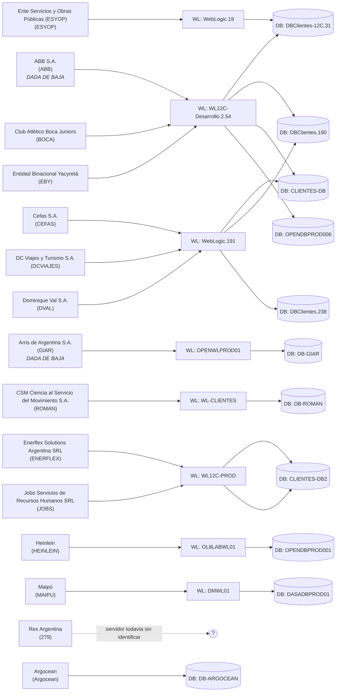

# Topología de infraestructura (vistas generadas)

Generado a partir de [`inventory.json`](inventory.json). No editar los diagramas de abajo a mano — regenerarlos desde el JSON (ver CLAUDE.md) cada vez que el JSON cambie, para que nunca queden desincronizados.

**Alcance: solo on-premise (vSphere).** La infraestructura en proveedores cloud (Azure/AWS) se estacionó fuera del alcance de este relevamiento — ver [../cloud-infra/README.md](../cloud-infra/README.md) para lo que ya se había encontrado ahí antes de acotar el foco.

## 1. Mapeo Cliente → WebLogic → Base de datos (vSphere on-premise)

Construido resolviendo los servidores WebLogic/DB declarados de cada cliente (del CSV de Relevamiento y, donde hay más detalle, de la matriz de clientes `Matriz_servicios_por_cliente_Hosting_V2.xlsx`) contra el inventario real de VMs en ExportList.csv — matcheado por nombre, y si el nombre no coincide, por IP (ver `resolved_by` en el JSON). 15 clientes en total: los 13 del CSV original de Relevamiento, más **Rex Argentina** y **Argocean**, ambos encontrados solo en la matriz más completa (ver findings.md). **ABB y Arris/GIAR están marcados en la matriz como ya dados de baja** — se mantienen en el diagrama porque sus VMs todavía existen y corren, pero no tratarlos como producción activa sin confirmar el estado actual.

Prestar atención a las instancias compartidas: varios clientes están en la *misma* VM de WebLogic y/o la misma VM de base de datos — es un dato de radio de impacto que conviene saber antes de tocar cualquiera de ellas.

**Leer este diagrama con cuidado — un nodo es engañoso:** `WL12C-Desarrollo.2.54 → DBClientes.190` y `WebLogic.191 → DBClientes.190` aparecen ambos porque ABB y DCVIAJES se resolvieron cada uno por separado; no significa que ABB y DCVIAJES compartan una instancia de WebLogic. Verificar contra `clients[].database.resolved` en el JSON antes de asumir que una flecha implica un WL compartido.

> La topología Azure/AKS que estaba acá se movió a [`../cloud-infra/topology-cloud.md`](../cloud-infra/topology-cloud.md) — infraestructura cloud fuera de alcance por ahora, ver [`../cloud-infra/README.md`](../cloud-infra/README.md).

## 2. Inventario de VMs por categoría (las 129 VMs, de ExportList.csv)

Solo los totales — ver `inventory.json` → `vms[].category` para la lista de miembros de cada grupo. Las categorías se asignaron por coincidencia de nombre/SO salvo que se indique lo contrario por confirmación vía el material de los emails/RAR (ver findings.md para qué está confirmado y qué sigue siendo conjetura).

| Categoría | Cantidad | Confianza |
|---|---|---|
| database | 30 | Mixta — varias confirmadas vía el mapeo de clientes, el resto inferidas solo por nombre |
| weblogic_app | 18 | Mixta — varias confirmadas vía el mapeo de clientes, el resto inferidas solo por nombre |
| workstation_or_jumphost | 20 | Inferida (SO invitado Windows 7/10 + nombre) |
| infra_generic_unclear | 12 | Desconocida — el nombre genérico `OPENINFRxx` no dice nada sobre el rol |
| docker_host_confirmed / docker_host_confirmed_nginx_proxy_manager | 9 | **Confirmada** — detalle a nivel contenedor del relevamiento de Docker, incl. cuáles 4 corren Nginx Proxy Manager |
| firewall_confirmed_pfsense | 1 (`OPENVPNFW01`) | **Confirmada** vía coincidencia de IP con el peer de VPN de Azure |
| firewall_candidate_pfsense | 8 | Inferida (SO invitado FreeBSD + nombre con fw/vpn), todavía sin confirmar |
| unclear | 17 | Sin señal en el nombre, o una conjetura previa (candidato a nginx) que resultó incorrecta |
| bi_reporting | 4 | Inferida (Jasper/MicroStrategy en el nombre) |
| backup | 2 | Inferida (Veeam en el nombre) |
| source_repo | 2 | Inferida (SVN en el nombre) |
| domain_controller, file_server, monitoring, mail, storage_nas, virtualization_mgmt | 1 cada una | Inferida por nombre/SO |

## 3. Hosts / clusters ESXi

Aparecen 12 IPs de host ESXi distintas en la columna `Host` de ExportList.csv:

- **192.1.1.214 – 192.1.1.224** (11 hosts) — cluster principal, aloja la mayoría de las VMs WL/DB de cara al cliente.
- **192.1.3.252** (1 host) — aloja un conjunto distinto de VMs en otros rangos de IP (`172.18.5.x`, `10.10.1.x`, `192.1.3.x`) incluyendo `WL-ROMAN`, `DB-ROMAN`, `DB-GIAR`, `WL-GIAR`, `FW`, `WL12-Clientes`. **Probablemente un sitio físico separado o una máquina standalone fuera del cluster principal** — vale la pena confirmarlo, ya que no comparte el patrón de gestión 192.1.1.x de los demás.

**"Piedras" — mencionado, sin confirmar, y probablemente no es esto.** Se nos mencionó (de forma verbal, sin más contexto) que existiría un sitio adicional llamado "Piedras". El único rastro técnico que tenemos es el nombre de una VM, `VEEAM-PIEDRAS` (servidor de backup), que corre en `192.1.1.221` — **dentro del cluster principal**, no en `192.1.3.252`. Así que si "Piedras" es un sitio físico real, no coincide con el único candidato a segundo sitio que ya teníamos identificado; podría ser un tercer lugar (por ejemplo, un destino de replicación de backups) del que no tenemos ningún otro dato. Ver `infra/findings.md` y `QUESTIONS.md`.

## Cómo regenerar estos diagramas

El diagrama de mapeo de clientes en la sección 1 es generado, no dibujado a mano. Si `inventory.json` cambia, regenerarlo con el mismo enfoque: recorrer `clients[]`, emitir un nodo por cliente y uno por cada `resolved_vm` distinta bajo `weblogic`/`database`, deduplicar nodos, y conectar cliente→WL→DB. Mantenerlo acotado al subconjunto de clientes — un diagrama con las 129 VMs no se puede leer y no vale la pena construirlo; el JSON es la fuente de verdad para el resto.
