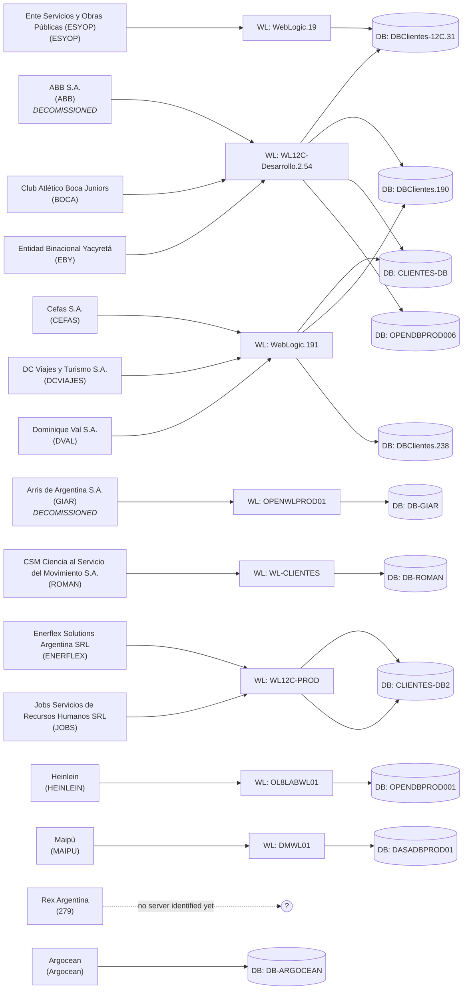
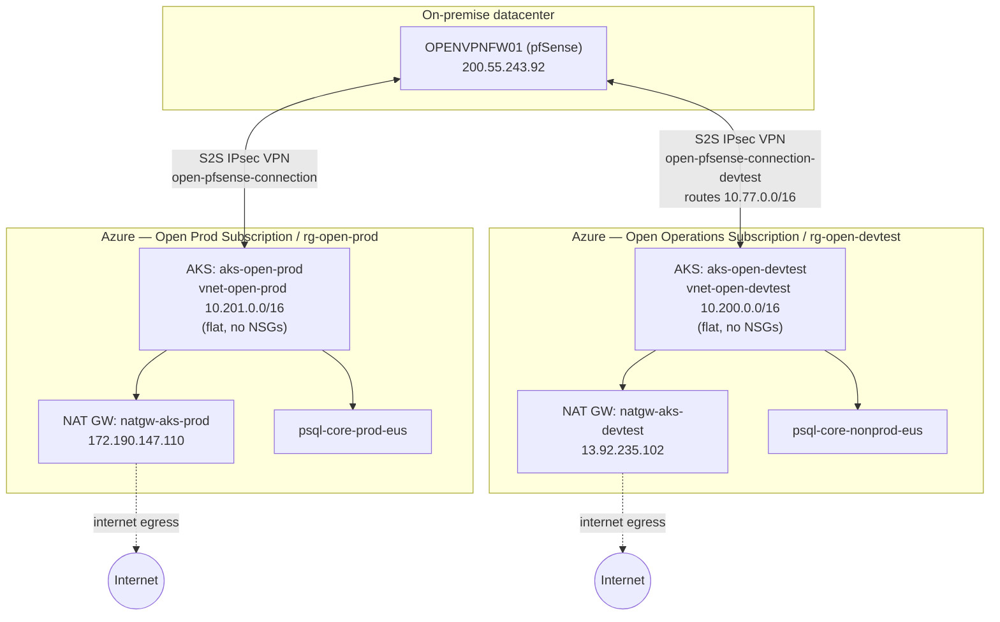

# Infra topology (generated views)

Generated from [`inventory.json`](inventory.json). Do not hand-edit the diagrams below —
regenerate them from the JSON (see CLAUDE.md) whenever the JSON changes, so they never drift out
of sync.

## 1. Client → WebLogic → Database mapping (on-premise vSphere)

Built by resolving each client's declared WebLogic/DB servers (from the Relevamiento CSV and,
where richer, the `Matriz_servicios_por_cliente_Hosting_V2.xlsx` client matrix) against the
actual VM inventory in ExportList.csv — matched by name, falling back to IP when the name didn't
match (see `resolved_by` in the JSON). 15 clients total: the 13 from the original Relevamiento
CSV, plus **Rex Argentina** and **Argocean**, both found only in the richer matrix (see
findings.md). **ABB and Arris/GIAR are flagged in the matrix as already decommissioned** — kept
in the diagram since their VMs still exist and run, but don't treat them as active production
without confirming current status.

Notice the shared instances: several clients sit on the *same* WebLogic VM and/or the same
database VM — that's a blast-radius fact worth knowing before touching any one of them.

**Read this diagram carefully — one node is misleading:** `WL12C-Desarrollo.2.54 → DBClientes.190`
and `WebLogic.191 → DBClientes.190` both appear because ABB and DCVIAJES were each resolved
independently; it does not mean ABB and DCVIAJES share a WebLogic instance. Cross-check
against `clients[].database.resolved` in the JSON before assuming an edge implies shared WL.

## 2. Azure/AKS — a second, separate infra plane

Sourced from `source-files/extracted/analisis_azure.txt`. This is **not** part of the vSphere
inventory above — different management plane entirely (Azure portal/CLI, not TeamViewer/vCenter).
Condor Work, Enterprise, and ProvIA application tiers run here as containers, not as vSphere VMs.

Both VPN tunnels terminate at the same pfSense box, `OPENVPNFW01` — confirmed by IP match
(`200.55.243.92`), not just guessed from FreeBSD guest OS. VPN traffic itself is low-volume
(mostly Oracle DB access and point integrations from Azure back to on-prem); the bulk of AKS
egress goes straight to the internet via NAT Gateway (ORDS/API calls), not through the tunnel.
Full detail — subscriptions, resource groups, public IPs, traffic volumes — is in
`inventory.json` → `azure` and the source doc.

## 3. VM inventory by category (all 129 VMs, from ExportList.csv)

Counts only — see `inventory.json` → `vms[].category` for the member list of each bucket.
Categories were assigned by name/OS pattern-matching unless otherwise confirmed by the email/RAR
material (see findings.md for what's now confirmed vs. still a guess).

| Category | Count | Confidence |
|---|---|---|
| database | 30 | Mixed — several confirmed via client mapping, rest inferred from name only |
| weblogic_app | 18 | Mixed — several confirmed via client mapping, rest inferred from name only |
| workstation_or_jumphost | 20 | Inferred (Windows 7/10 guest OS + naming) |
| infra_generic_unclear | 12 | Unknown — generic `OPENINFRxx` naming tells us nothing about role |
| docker_host_confirmed / docker_host_confirmed_nginx_proxy_manager | 9 | **Confirmed** — container-level detail from the Docker survey doc, incl. which 4 run Nginx Proxy Manager |
| firewall_confirmed_pfsense | 1 (`OPENVPNFW01`) | **Confirmed** via Azure VPN peer IP match |
| firewall_candidate_pfsense | 8 | Inferred (FreeBSD guest OS + fw/vpn naming), still unconfirmed |
| unclear | 17 | No naming signal, or a prior guess (nginx-candidate) that turned out wrong |
| bi_reporting | 4 | Inferred (Jasper/MicroStrategy in name) |
| backup | 2 | Inferred (Veeam in name) |
| source_repo | 2 | Inferred (SVN in name) |
| domain_controller, file_server, monitoring, mail, storage_nas, virtualization_mgmt | 1 each | Inferred from name/OS |

## 4. ESXi hosts / clusters

12 distinct ESXi host IPs appear in the `Host` column of ExportList.csv:

- **192.1.1.214 – 192.1.1.224** (11 hosts) — main cluster, hosts most client-facing WL/DB VMs.
- **192.1.3.252** (1 host) — hosts a distinct set of VMs on different IP ranges
  (`172.18.5.x`, `10.10.1.x`, `192.1.3.x`) including `WL-ROMAN`, `DB-ROMAN`, `DB-GIAR`,
  `WL-GIAR`, `FW`, `WL12-Clientes`. **Likely a separate physical site or a standalone host
  outside the main cluster** — worth confirming, since it doesn't share the 192.1.1.x
  management pattern of the others.

## Regenerating these diagrams

The client-mapping diagram in section 1 is generated, not hand-drawn. If `inventory.json`
changes, regenerate it with the same approach: walk `clients[]`, emit one node per client and
one node per distinct `resolved_vm` under `weblogic`/`database`, dedupe nodes, and wire
client→WL→DB. Keep it to the client subset — a full 129-node diagram is unreadable and not
worth building; the JSON is the source of truth for the long tail. The Azure diagram in section 2
is hand-maintained since it describes a small, stable set of named cloud resources rather than a
generated cross-reference — update it directly if `inventory.json` → `azure` changes.
